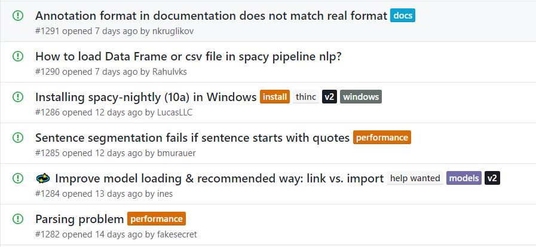

# Ideas
Content ideas

## NLP

### Text Classification

#### Categorize Github Issues

Keeping the issue tracker tidy is something many open source projects struggle with – so automated tools could definitely be helpful. How easy would it be to create a bot to tag the issues automatically? Text classification really shines when the task would otherwise be performed by hand.

- Training data: Easy to collect labeled data from existing Github issues (example: [spaCy issues](https://github.com/explosion/spaCy/issues))
  - Label categories: [https://robinpowered.com/blog/best-practice-system-for-organizing-and-tagging-github-issues/](https://robinpowered.com/blog/best-practice-system-for-organizing-and-tagging-github-issues/)
- Model: 
  - fastText: [https://github.com/facebookresearch/fastText](https://github.com/facebookresearch/fastText)
  - Comparison of different models: [https://github.com/brightmart/text_classification](https://github.com/brightmart/text_classification)
- Idea source: https://explosion.ai/blog/prodigy-annotation-tool-active-learning

### Reading

- [Applying deep learning to real-world problems](https://medium.com/merantix/applying-deep-learning-to-real-world-problems-ba2d86ac5837)
